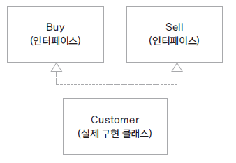
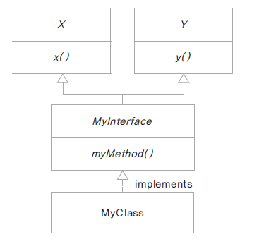

# 15. 여러 인터페이스 구현하기, 인터페이스의 상속

## 여러 인터페이스 구현

- 자바의 인터페이스는 구현 코드가 없으므로 하나의 클래스가 여러 인터페이스는 구현 할 수 있음 

- 디폴트 메서드가 중복 되는 경우는 구현 하는 클래스에서 재정의 하여야 함

- 여러 인터페이스를 구현한 클래스는 인터페이스 타입으로 형 변환 되는 경우 해당 인터페이스에 선언된 메서드만 사용 가능 함





Sell.java
```
public interface Sell {

	void sell();
	
	
}
```

Buy.java
```
public interface Buy {

	void buy();

}
```

Customer.java
```
public class Customer implements Buy, Sell{

	@Override
	public void sell() {
		System.out.println("customer sell");
	}

	@Override
	public void buy() {
		System.out.println("customer buy");		
	}

	public void sayHello() {
		System.out.println("Hello");
	}
}
```
CustomerTest.java
```
public class CustomerTest {

	public static void main(String[] args) {

		Customer customer = new Customer();
		customer.buy();
		customer.sell();
		customer.sayHello();
		
		Buy buyer = customer;
		buyer.buy();
		
		Sell seller = customer;
		seller.sell();

	}
}
```

## 디폴트 메서드가 중복 되는 경우

- 구현 코드를 가지고 인스턴스 생성된 경우만 호출되는 디폴트 메서드의 경우 두 개의 인터페이스에서 중복되면 구현하는 클래스에서 반드시 재정의를 해야 함

Sell.java
```
public interface Sell {

	void sell();
	
	default void order() {
		System.out.println("판매 주문");
	}
}
```

Buy.java
```
public interface Buy {

	void buy();

	default void order() {
		System.out.println("구매 주문");
	}
}
```

Customer.java
```
public class Customer implements Buy, Sell{

	@Override
	public void sell() {
		System.out.println("customer sell");
	}

	@Override
	public void buy() {
		System.out.println("customer buy");		
	}

	public void sayHello() {
		System.out.println("Hello");
	}

	@Override
	public void order() {
		System.out.println("customer order");
	}

}
```
CustomerTest.java
```
public class CustomerTest {

	public static void main(String[] args) {

		Customer customer = new Customer();
		customer.buy();
		customer.sell();
		customer.sayHello();
		
		Buy buyer = customer;
		buyer.buy();
		
		Sell seller = customer;
		seller.sell();
	
		buyer.order();
		seller.order();
	
	}
}
```


## 인터페이스의 상속

- 인터페이스 사이에도 상속을 사용할 수 있음

- extends 키워드를 사용

- 인터페이스는 다중 상속이 가능하고 구현 코드의 상속이 아니므로 타입 상속 이라고 함



X.java
```
public interface X {

	void x();
}
```

Y.java
```
public interface Y {

	void y();
}
```

MyInterface.java
```
public interface MyInterface extends X, Y{

	void myMethod();
}
```

MyClass.java
```
public class MyClass implements MyInterface{

	@Override
	public void x() {
		System.out.println("x()");
	}

	@Override
	public void y() {
		System.out.println("y()");		
	}

	@Override
	public void myMethod() {
		System.out.println("myMethod()");		
	}
}
```

MyClassTest.java
```
public class MyClassTest {

	public static void main(String[] args) {

		MyClass mClass = new MyClass();
		
		X xClass = mClass;
		xClass.x();
		
		
		Y yClass = mClass;
		yClass.y();
		
		MyClass iClass = mClass;
		iClass.x();
		iClass.y();
		iClass.myMethod();
	}

}
```

## 클래스 상속과 인터페이스 구현 함께 쓰기

- 실무에서 프레임워크나 오픈소스와 함께 연동되는 구현을 하게 되면 클래스 상속과 인터페이스의 구현을 같이 사용하는 경우가 많음


- 책이 순서대로 대여가 되는 도서관 구현

- 책을 보관하는 자료 구조가 Shelf에 구현됨 (ArrayList)

- Queue 인터페이스를 구현함

- Shelf 클래스를 상속 받고 Queue를 구현한다.

Shelf.java
```
public class Shelf {

	 protected ArrayList<String> shelf;
	 
	 public Shelf() {
		 shelf = new ArrayList<String>();
	 }
	 
	 public ArrayList<String> getShelf(){
		 return shelf;
	 }
	 
	 public int getCount() {
		 return shelf.size();
	 }
	 
}
```

Queue.java
```
public interface Queue {

	void enQueue(String title);
	String deQueue();
	
	int getSize();
}
```

BookShelf.java
```
public class BookShelf extends Shelf implements Queue{

	@Override
	public void enQueue(String title) {
		shelf.add(title);
	}

	@Override
	public String deQueue() {
		return shelf.remove(0);
	}

	@Override
	public int getSize() {
		return getCount();
	}

}
```

BookShelfTest.java
```
public class BookShelfTest {

	public static void main(String[] args) {

		Queue bookQueue = new BookShelf();
		bookQueue.enQueue("태백산맥1");
		bookQueue.enQueue("태백산맥2");
		bookQueue.enQueue("태백산맥3");
		
		System.out.println(bookQueue.deQueue());
		System.out.println(bookQueue.deQueue());
		System.out.println(bookQueue.deQueue());
	}

}
```


## 다음 강의

[16. 복습해보세요](https://github.com/heewonim131/java-course/tree/main/Chapter3/3-16/README.md)

